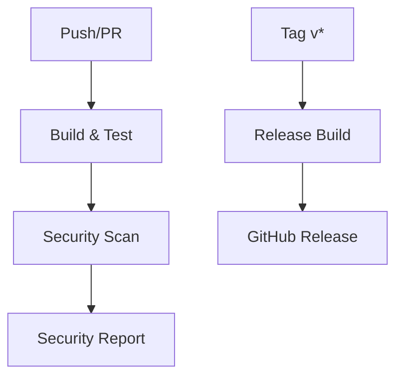

# GitHub Actions Configuration for Azure DevOps Docker Agent

This repository includes comprehensive GitHub Actions workflows for automated building, testing, and deployment of Docker images.

## 🚀 Available Workflows

### 1. **Build and Push Docker Images** (`.github/workflows/docker-build.yml`)

**Triggers:**
- Push to `main` or `develop` branches
- Pull requests to `main`
- Manual dispatch
- Git tags (`v*`)

**Features:**
- ✅ Multi-architecture builds (AMD64, ARM64, ARMv7)
- ✅ Windows container support (separate workflow)
- ✅ GitHub Container Registry (GHCR) publishing
- ✅ Docker layer caching for faster builds
- ✅ Metadata extraction for proper tagging
- ✅ Basic image testing
- ✅ Build summary generation

### 2. **Security Scanning** (`.github/workflows/security-scan.yml`)

**Triggers:**
- Push to `main` branch
- Pull requests to `main`
- Weekly schedule (Mondays at 2 AM)

**Features:**
- 🔒 Trivy vulnerability scanning
- 🔒 SARIF upload to GitHub Security tab
- 🔒 Automated security reporting
- 🔒 CVE detection and analysis

### 3. **Release Management** (`.github/workflows/release.yml`)

**Triggers:**
- Git tags with semantic versioning (`v*.*.*`)

**Features:**
- 📦 Multi-platform release builds
- 📦 Automatic GitHub Release creation
- 📦 Release notes generation
- 📦 Semantic version tagging

### 4. **Windows Container Build** (`.github/workflows/build-windows.yml`)

**Triggers:**
- Push to `main` branch
- Git tags (`v*`)
- Manual dispatch

**Features:**
- 🪟 Windows Server Core based containers
- 🪟 PowerShell-based agent configuration
- 🪟 aws-ssm Windows binary integration
- 🪟 Chocolatey package management

## 📋 Setup Instructions

### 1. Configure Docker Hub Secrets

1. Go to your repository **Settings** → **Secrets and variables** → **Actions**
2. Add the following secrets:
   - `DOCKERHUB_USERNAME`: Your Docker Hub username (should be `hypolas`)
   - `DOCKERHUB_TOKEN`: Your Docker Hub access token

**To create a Docker Hub access token:**
1. Go to [Docker Hub](https://hub.docker.com/) → Account Settings → Security
2. Click "New Access Token"
3. Give it a name (e.g., "GitHub Actions")
4. Select "Read, Write, Delete" permissions
5. Copy the generated token

### 2. Enable GitHub Actions

1. Go to your repository **Settings** → **Actions** → **General**
2. Set **Workflow permissions** to "Read and write permissions"
3. Check "Allow GitHub Actions to create and approve pull requests"

### 3. Create Your First Release

```bash
# Tag your commit with semantic version
git tag v1.0.0
git push origin v1.0.0
```

## 🏷️ Tagging Strategy

| Tag Pattern | Example | Description |
|-------------|---------|-------------|
| `v*.*.*` | `v1.2.3` | Full semantic version |
| `v*.*.*-*` | `v1.2.3-beta` | Pre-release version |
| `main` | `main` | Latest development |
| `sha-*` | `sha-abc1234` | Commit-specific |

## 📦 Generated Images

Images are published to Docker Hub:

```bash
# Latest stable
docker pull hypolas/azure-devops-agent:latest

# Specific version
docker pull hypolas/azure-devops-agent:v1.0.0

# Development
docker pull hypolas/azure-devops-agent:main

# Platform-specific
docker pull hypolas/azure-devops-agent:latest-amd64
docker pull hypolas/azure-devops-agent:latest-arm64
docker pull hypolas/azure-devops-agent:latest-armv7

# Windows
docker pull hypolas/azure-devops-agent:latest-windows-amd64
```

## 🔧 Customization

### Build Arguments

Modify `build-args` in workflows to customize:

```yaml
build-args: |
  INSTALL_AWS_SSM=true
  # Add other build arguments here
```

### Additional Platforms

Add more platforms in the build step:

```yaml
platforms: linux/amd64,linux/arm64,linux/arm/v7,linux/386
```

**Supported Platforms by aws-ssm:**
- ✅ **Linux**: amd64, arm64, armv7 (via Docker multi-arch)
- ✅ **Windows**: amd64 (via Windows containers)
- ⚠️ **macOS**: Not supported in GitHub Actions (use local builds)
- ⚠️ **Windows ARM64**: Limited GitHub Actions support

### GitHub Container Registry Publishing

To also publish to GitHub Container Registry, add this login step:

```yaml
- name: Log in to GitHub Container Registry
  uses: docker/login-action@v3
  with:
    registry: ghcr.io
    username: ${{ github.actor }}
    password: ${{ secrets.GITHUB_TOKEN }}
```

## 🔍 Monitoring and Debugging

### View Build Logs
1. Go to **Actions** tab in your repository
2. Select the workflow run
3. Expand steps to view detailed logs

### Security Reports
1. Go to **Security** tab
2. View **Vulnerability alerts** for Trivy results

### Container Registry
1. Go to [Docker Hub](https://hub.docker.com/r/hypolas/azure-devops-agent)
2. View all available tags and versions
3. Check download statistics and usage

## 🚀 Local Testing

Test workflows locally with [act](https://github.com/nektos/act):

```bash
# Install act
brew install act  # macOS
# or
curl https://raw.githubusercontent.com/nektos/act/master/install.sh | sudo bash

# Test build workflow
act push

# Test pull request workflow
act pull_request
```

## 🔄 Workflow Dependencies



## 📊 Performance Optimizations

- **Docker Layer Caching**: Reuses layers between builds
- **Multi-stage Builds**: Optimized Dockerfile structure  
- **Parallel Jobs**: Security scanning runs independently
- **Build Cache**: GitHub Actions cache for faster rebuilds

---

*These workflows provide production-ready CI/CD for your Azure DevOps Docker Agent with security scanning and automated releases.*